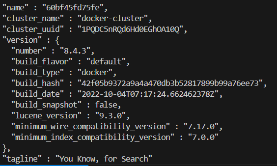

## Solutions

See 01-intro/rag-homework.ipynb

### Q1. Running Elastic

Run Elastic Search 8.4.3, and get the cluster information. If you run it on localhost, this is how you do it:

```bash
curl localhost:9200
```

**Answer:** The `version.build_hash` value is `42f05b9372a9a4a470db3b52817899b99a76ee73`. 



### Q2. Indexing the data

**Answer:** `index`.

### Q3. Searching

**Answer:** The score for the top ranking result is `84.05`.

### Q4. Filtering

**Answer:** The third question returned by the search engine is: How do I copy files from a different folder into docker container’s working directory?

### Q5. Building a prompt

**Answer:** 
Prompt is: You're a course teaching assistant. Answer the QUESTION based on the CONTEXT from the FAQ database.
Use only the facts from the CONTEXT when answering the QUESTION.

QUESTION: How do I execute a command in a running docker container?

CONTEXT:
Q: How do I debug a docker container?
A: Launch the container image in interactive mode and overriding the entrypoint, so that it starts a bash command.
docker run -it --entrypoint bash <image>
If the container is already running, execute a command in the specific container:
docker ps (find the container-id)
docker exec -it <container-id> bash
(Marcos MJD)

Q: How do I copy files from my local machine to docker container?
A: You can copy files from your local machine into a Docker container using the docker cp command. Here's how to do it:
To copy a file or directory from your local machine into a running Docker container, you can use the `docker cp command`. The basic syntax is as follows:
docker cp /path/to/local/file_or_directory container_id:/path/in/container
Hrithik Kumar Advani

Q: How do I copy files from a different folder into docker container’s working directory?
A: You can copy files from your local machine into a Docker container using the docker cp command. Here's how to do it:
In the Dockerfile, you can provide the folder containing the files that you want to copy over. The basic syntax is as follows:
COPY ["src/predict.py", "models/xgb_model.bin", "./"]											Gopakumar Gopinathan


The length of the resulting prompt is `1462`.

### Q6. Tokens

**Answer:** The number of tokens in the resulting prompt is: 322

### Bonus: generating the answer (ungraded)

**Answer:** 
Send the prompt to OpenAI. 

Output: To execute a command in a running Docker container, you need to use the `docker exec` command. Here are the steps:

1. First, find the container ID of the running container by using the `docker ps` command.
2. Once you have the container ID, you can use the following command to execute a bash shell inside the container:
   ```bash
   docker exec -it <container-id> bash
   ```

Replace `<container-id>` with the actual ID of your running container. This will open up an interactive terminal session within the container where you can execute commands.


### Bonus: calculating the costs (ungraded)

**Answer:** 

- Cost to run 1000 requests:
- Total Input Tokens: 150000
- Total Output Tokens: 250000
- Cost for Input Tokens: $ 0.75
- Cost for Output Tokens: $ 3.75
- Total Cost for 1000 Requests: $ 4.5


For Q6 and Q7(Bonus):

We have

Response from OpenAI:
To execute a command in a running Docker container, you need to use the `docker exec` command. Here are the steps:

1. First, find the container ID of the running container by using the `docker ps` command.
2. Once you have the container ID, you can use the following command to execute a bash shell inside the container:
   ```bash
   docker exec -it <container-id> bash
   ```

Replace `<container-id>` with the actual ID of your running container. This will open up an interactive terminal session within the container where you can execute commands.


The number of tokens in the response is(output): 120

Input token using tiktoken (Q6) was: 322

- Total Input Tokens: 322000
- Total Output Tokens: 120000
- Cost for Input Tokens: $ 1.61
- Cost for Output Tokens: $ 1.8
- Total Cost for 1000 Requests: $ 3.41


