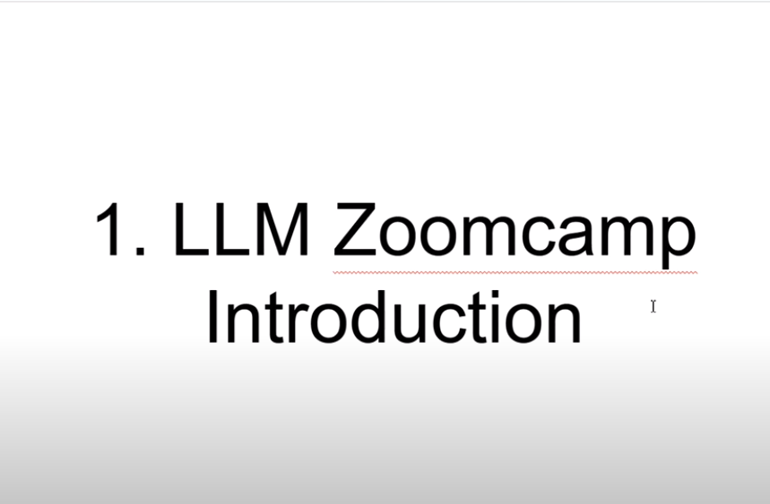
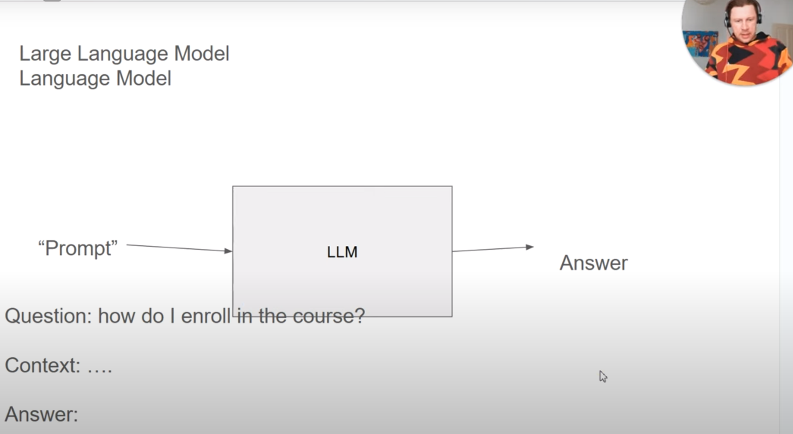
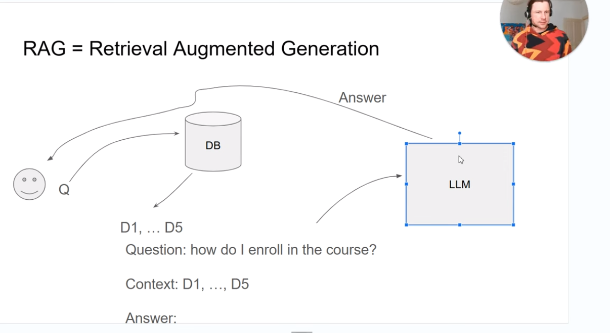

[Next](preparing-the-environment.md)

# Introduction to Large Language Models (LLM) and Retrieval-Augmented Generation (RAG)

## Overview

In this chapter, we will explore the basics of LLM and RAG. We will discuss their architecture, use cases, and the expected outcomes of this course.

## Topics Covered

- What is a LLM?
- What is RAG?
- RAG Architecture
- Course Outcomes

## What is a LLM?

LLMs are advanced machine learning models trained on vast amounts of text data. They are capable of understanding and generating human-like text, making them useful for a variety of applications such as chatbots, content generation, and more.

## What is RAG?

RAG is a technique that combines the power of retrieval-based methods with generative models. It involves retrieving relevant documents or information and using that context to generate more accurate and relevant responses.

## RAG Architecture

The RAG architecture typically consists of two main components:
1. **Retriever**: This component retrieves relevant documents or information based on the input query.
2. **Generator**: This component generates a response using the retrieved documents as context.

## Course Outcomes

By the end of this course, you will:
- Understand the basics of LLM and RAG.
- Be able to implement a simple RAG pipeline.
- Gain hands-on experience with indexing and searching documents.
- Learn to integrate OpenAI for answer generation.
- Understand how to use Elasticsearch for improved search capabilities.

[Next](preparing-the-environment.md)