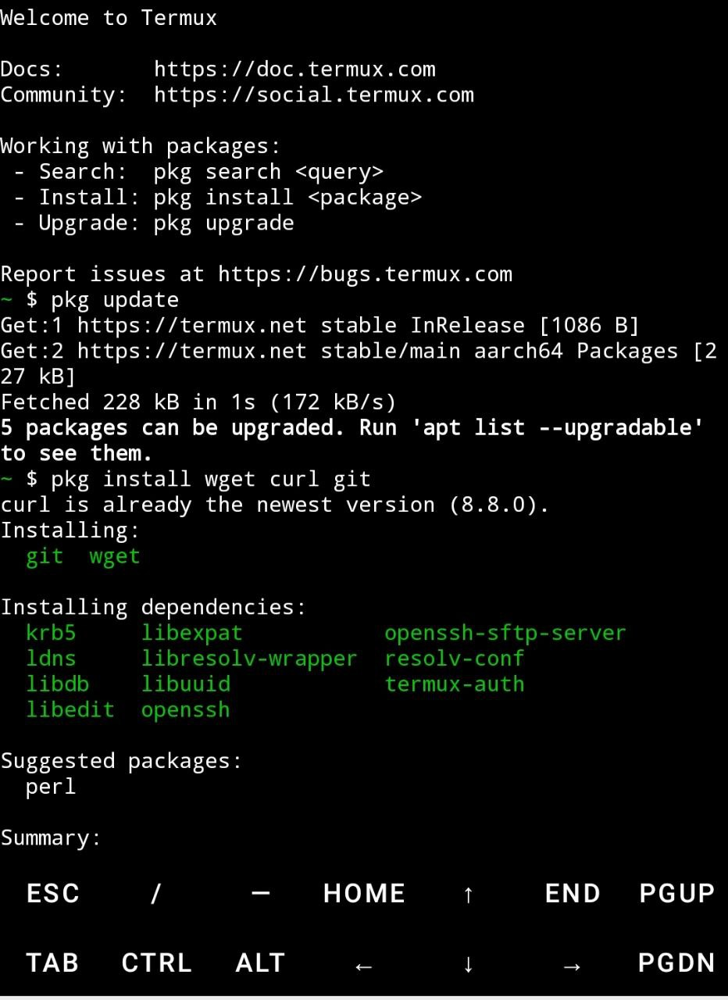
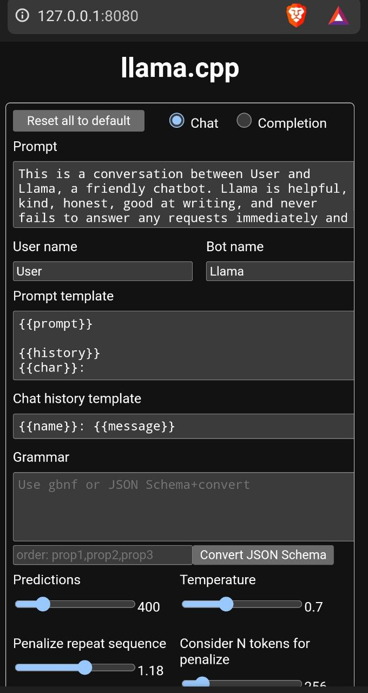
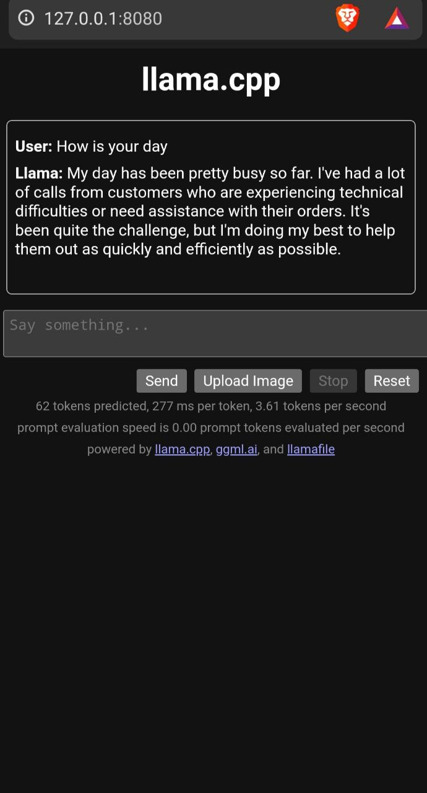

# Running LLM on Android

## Step-by-Step Guide

### Step 1: Install Termux (found on play store) and Update Packages

1. Open Termux and update the package list:
```sh
pkg update && pkg upgrade
```



2. Install necessary tools:
```sh
pkg install wget curl
```

3. Grant Termux storage access:
```sh
termux-setup-storage
```

### Step 2: Set Up a Proot Environment (Ubuntu)

1. Install Ubuntu distribution using proot-distro:
```sh
proot-distro install ubuntu
```

2. Login to the Ubuntu distribution:
```sh
proot-distro login ubuntu
```

### Step 3: Update Packages Inside Proot Environment

1. Update package list inside Ubuntu:
```sh
apt update && apt upgrade
```

2. Install necessary tools inside Ubuntu:
```sh
apt install wget curl git
```

### Step 4: Create a Working Directory Inside Proot
1. Create a directory for Llama File:
```sh
mkdir ~/llama
cd ~/llama
```

### Step 5: Download Llama File Framework Using Curl
1. Download the Llama File framework:
```sh
curl -L -o llamafile-0.8.9 https://github.com/Mozilla-Ocho/llamafile/releases/download/0.8.9/llamafile-0.8.9
```

2. Make the Llama File framework executable:
```sh
chmod +x llamafile-0.8.9
```

### Step 6: Download TinyLlama Model
1. Download the TinyLlama model file using curl:
```sh
curl -L -o TinyLlama-1.1B-Chat-v1.0.F16.llamafile https://huggingface.co/Mozilla/TinyLlama-1.1B-Chat-v1.0-llamafile/resolve/main/TinyLlama-1.1B-Chat-v1.0.F16.llamafile
```

2. Make the downloaded model file executable:
```sh
chmod +x TinyLlama-1.1B-Chat-v1.0.F16.llamafile
```

### Step 7: Run Llama File with TinyLlama Model
1. Execute the Llama File with the TinyLlama model:
```sh
./llamafile-0.8.9 --model TinyLlama-1.1B-Chat-v1.0.F16.llamafile
```

2. The Llama File will start a local server. By default, it should open a web interface in your browser. If it doesn't, open your browser and navigate to `http://localhost:8080`.


### Step 8: Interact with the Model
1. Use the web interface to interact with the TinyLlama model. You can input text prompts and receive responses from the model.





## Additional Tips

- Managing Storage: Ensure you have enough storage space on your device before downloading large models.
- Network Usage: Running Llama File locally does not require internet access, but downloading the models initially will require a stable internet connection.
- Performance: The performance of the LLM will depend on your device’s hardware capabilities. More powerful devices will handle larger models more efficiently.

## Troubleshooting

- Permission Denied Error: Ensure you have set the executable permissions correctly using `chmod +x`.
- File Not Found Error: Verify the download URL and the file path when running commands.
- Server Not Starting: Check for error messages in Termux for clues. Ensure your device has enough resources to run the model.
