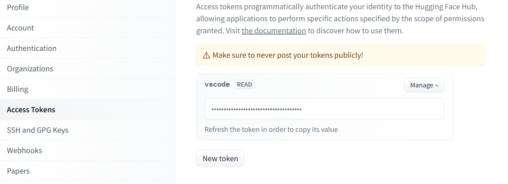
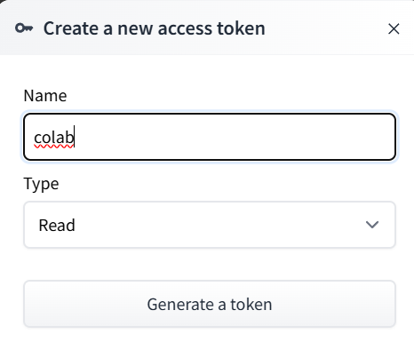
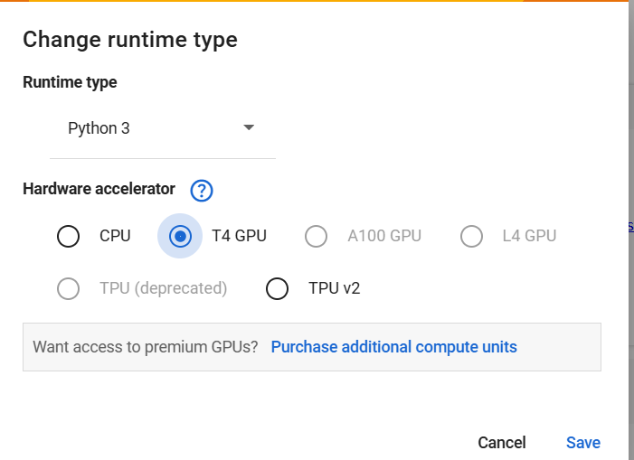
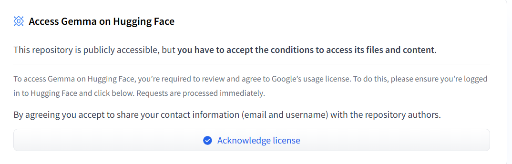

# Running LLM Models on Free Google Colab: Step-by-Step Guide


We will go through the steps to run the Google Gemma 2 9B (or any other) model on Google Colab. The Gemma 2 model is lightweight, versatile, and powerful for tasks such as text generation, coding, and mathematics. We'll cover the setup process, including obtaining necessary permissions and tokens, installing prerequisites, and configuring the model for use.


## Prerequisites
- A Google account
- A Hugging Face account

## Setting Up Google Colab
1. Go to [Google Colab](https://colab.research.google.com/).
2. Sign in with your Google account.
3. Create a new notebook by clicking on `File > New Notebook in Drive`.

## Obtaining Necessary Permissions and Tokens

### Google Permissions
1. Ensure you have the necessary permissions to run Google Colab. Usually, this means having an active Google account with Colab access.

### Hugging Face Token
1. Go to [Hugging Face](https://huggingface.co/).
2. Create an account if you don't have one.
3. Navigate to your account settings and create an access token with `read` type.






## Installing Prerequisites
In your new Colab notebook, run the following commands to install the required libraries and log in to Hugging Face:

- First, change the runtime to use T4 GPU


- Verify that the GPU is correctly enabled:

```python
!nvidia-smi
```

- Install Hugging Face Transformers and Accelerate

```python
!pip -q install git+https://github.com/huggingface/transformers
!pip -q install accelerate
```

- Additionally, install the Hugging Face Hub and ipywidgets for model management and interactive widgets:

```python
!pip install huggingface_hub
!pip install ipywidgets
```

# Log in to Hugging Face

To authenticate and gain access to Hugging Face resources, run the following code to log in:

```python
from huggingface_hub import notebook_login
notebook_login()
```

Follow the prompts to enter your Hugging Face token and log in.

## Downloading and Setting Up Gemma 2 Model
Next, you'll need to download and set up the Gemma 2 model for text generation on a GPU.

To access the model, accept the conditions.



2. Download the Gemma 2 model:

```python
from transformers import AutoTokenizer, AutoModelForCausalLM


tokenizer = AutoTokenizer.from_pretrained("google/gemma-2-9b-it")
model = AutoModelForCausalLM.from_pretrained(
    "google/gemma-2-9b-it",
    device_map="auto",
    torch_dtype=torch.bfloat16
)

```


## Running the Model

Now, you can run the model for text generation tasks. Create a function to generate text using the model:

```python
def generate(input_text, system_prompt="", max_length=512):
    if system_prompt != "":
        system_prompt = system_prompt
    else:
        system_prompt = "You are a friendly and helpful assistant"
    messages = [
        {"role": "user", "content": system_prompt + '\n\n' + input_text},
    ]

    prompt = tokenizer.apply_chat_template(messages, tokenize=False, add_generation_prompt=True)

    inputs = tokenizer.encode(prompt, add_special_tokens=True, return_tensors="pt").to("cuda")
    outputs = model.generate(input_ids=inputs.to(model.device), max_new_tokens=max_length, do_sample=True, temperature=0.1, top_k=50)
    text = tokenizer.decode(outputs[0], skip_special_tokens=True, clean_up_tokenization_spaces=True)
    text = text.replace('user\n' + system_prompt + '\n\n' + input_text + '\nmodel', '', 1)
    display(Markdown(text))
```

Generate text with the following command:

```python
generate('Once upon a time',
         system_prompt="You are Gemma, a large language model trained by Google",
         max_length=50)
```

## Conclusion
You've now set up and run the Google Gemma 2 9B model on Google Colab. This model excels in various tasks, including text generation, coding, and mathematics, thanks to its training on diverse datasets.
