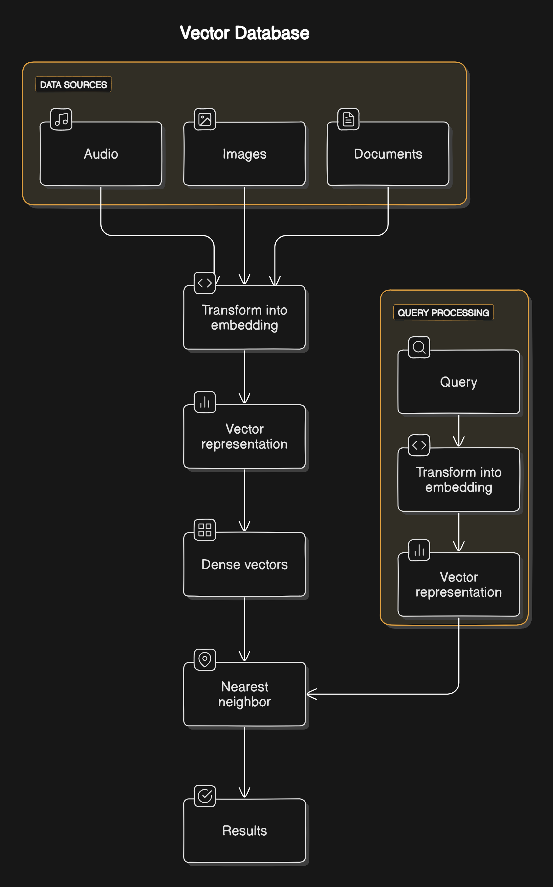

[Previous](../README.md) | [Next](02-semantic-search-with-elasticsearch.md)

# Introduction to Vector Search

In the evolving landscape of data management, vector databases have emerged as a critical solution for handling vast and diverse datasets. Unlike traditional databases, which are limited to structured data, vector databases excel in managing unstructured data and providing relevant results based on context.

## What is Vector Search?

Vector search is a method of finding similar items in a dataset by comparing their vector representations. Unlike traditional keyword-based search, which relies on exact matches, vector search uses mathematical representations of data to find items that are similar in meaning or context.

## Why Use Vector Search?

- **Semantic Understanding**: Vector search can understand the context and meaning behind words, making it more effective for natural language processing tasks.
- **Scalability**: It can handle large datasets efficiently.
- **Flexibility**: It can be used for various types of data, including text, images, and audio.

## How Does Vector Search Work?

1. **Data Representation**: Data is converted into vectors using techniques like word embeddings, sentence embeddings, document embeddings, or image embeddings.
2. **Indexing**: These vectors are stored in a vector database or an index.
3. **Querying**: When a query is made, it is also converted into a vector.
4. **Similarity Measurement**: The query vector is compared with the indexed vectors using similarity measures like cosine similarity or Euclidean distance.
5. **Retrieval**: The most similar items are retrieved and presented as search results.

## Key Concepts

### What are Embeddings?

Embeddings are dense vector representations of data that capture the semantic meaning and associations of text, images, and other data types, placing similar meanings closer together in vector space.
They are fundamental to vector search as they allow for the comparison of data in a continuous vector space. Various types of data, including words, sentences, documents, and images, can be converted into embeddings. 

### How are Embeddings Generated?

The process of creating vector embeddings involves several steps:
1. **Data Collection and Preprocessing**: Gathering and preparing the data.
2. **Training the Model**: Using machine learning to identify patterns and representations in the data.
3. **Generating Embeddings**: Creating numerical representations based on the trained model.
4. **Iteration**: Continuously refining the model to improve the quality of embeddings.

Pre-trained models from platforms like Hugging Face can be leveraged to simplify this process. For sentence embeddings, models like Sentence Transformers (e.g., 'all-mpnet-base-v2') are commonly used. These models are trained to capture the context and meaning of sentences by converting them into high-dimensional vectors.

### The Role of Indexing in Vector Databases

Efficient storage and retrieval of data are critical for vector databases. Indexing methods ensure that data is managed optimally, allowing for fast and accurate searches. Different indexing techniques are used to achieve this efficiency.

#### Applications of Embeddings

- **Natural Language Processing (NLP)**: Embeddings are widely used in NLP tasks such as text classification, sentiment analysis, and machine translation.
- **Search and Information Retrieval**: Embeddings enable semantic search, where the search system understands the context and meaning behind queries to return more relevant results.
- **Recommendation Systems**: Embeddings help in finding similar items, such as products or content, based on user preferences.

By leveraging embeddings, we can build more intelligent and context-aware systems that go beyond simple keyword matching to understand the deeper meaning of the data.

### Similarity Measures

- **Cosine Similarity**: Measures the cosine of the angle between two vectors. It ranges from -1 to 1, where 1 means the vectors are identical.
- **Euclidean Distance**: Measures the straight-line distance between two vectors in a multi-dimensional space.

In the next chapter, we will demonstrate how to set up a semantic search engine using Elasticsearch. This hands-on lab will illustrate the concepts discussed, providing a comprehensive understanding of vector databases in action. Remember, vector search is a broader concept that involves finding similar items in a dataset by comparing their vector representations.

[Previous](../README.md) | [Next](02-semantic-search-with-elasticsearch.md)
