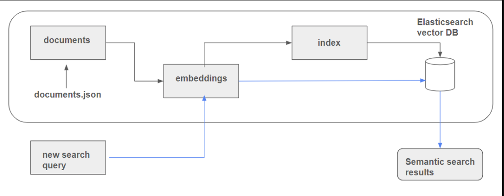

[Previous](01-introduction-to-vector-search.md) | [Next](03-evaluating-retrieval.md)

# Semantic Search with Elasticsearch

## Introduction

In this chapter, we will explore how to build a semantic search engine using Elasticsearch and Python. Semantic search using Elasticsearch is a specific implementation of vector search that leverages Elasticsearch's capabilities to perform semantic search. It enhances traditional search by understanding the context and meaning behind the search terms, going beyond keyword matching to deliver more relevant results.



## Why Use Elasticsearch for Semantic Search?

- **Scalability**: Elasticsearch can handle large volumes of data and high query loads.
- **Flexibility**: It supports various types of data, including text, numbers, and geospatial data.
- **Advanced Features**: Elasticsearch offers advanced search features like full-text search, filtering, and aggregations.

## Understanding Documents and Indexes in Elasticsearch

Elasticsearch is a distributed search engine that stores data in the form of documents. Two very important concepts in Elasticsearch are documents and indexes.

### Documents

A document is a collection of fields with their associated values. Each document is a JSON object that contains data in a structured format. For example, a document representing a book might contain fields like title, author, and publication date.

### Indexes

An index is a collection of documents that is stored in a highly optimized format designed to perform efficient searches. Indexes are similar to tables in a relational database, but they are more flexible and can store complex data structures.

To work with Elasticsearch, you need to organize your data into documents and then add all your documents to an index. This allows Elasticsearch to efficiently search and retrieve relevant documents based on the search queries.

## Set up the Environment

The process involves setting up a Docker container, preparing data, generating embeddings with a pre-trained model, and indexing these embeddings into Elasticsearch.

First, check if Docker is running. If not, use a command from a previous module to start a Docker container for Elasticsearch:

```python
docker run -it \
    --rm \
    --name elasticsearch \
    -p 9200:9200 \
    -p 9300:9300 \
    -e "discovery.type=single-node" \
    -e "xpack.security.enabled=false" \
    docker.elastic.co/elasticsearch/elasticsearch:8.4.3
```

### Data Loading and Preprocessing

In this step, we will load the `documents.json` file and preprocess it to flatten the hierarchy, making it suitable for Elasticsearch. The `documents.json` file contains a list of courses, each with a list of documents. We will extract each document and add a `course` field to it, indicating which course it belongs to.

### Embeddings - Sentence Transformers

To perform semantic search, we need to convert our documents into dense vectors (embeddings) that capture the semantic meaning of the text. We will use a pre-trained model from the Sentence Transformers library to generate these embeddings. These embeddings are then indexed into Elasticsearch. These embeddings enable us to perform semantic search, where the goal is to find text that is contextually similar to a given query.

The `text` and `question` fields are the actual data fields containing the primary information, whereas other fields like `section` and `course` are more categorical and less informative for the purpose of creating meaningful embeddings.

- Install the `sentence_transformers` library. 
- Load the pre-trained model and use it to generate embeddings for our documents.


### Connecting to Elasticsearch

In this step, we will set up a connection to an Elasticsearch instance. Make sure you have Elasticsearch running.

```python
from elasticsearch import Elasticsearch

# Connect to the Elasticsearch instance
es_client = Elasticsearch('http://localhost:9200')

# Check the connection
print(es_client.info())
```

### Create Mappings and Index

We will define the mappings and create the index in Elasticsearch, where the generated embeddings will also be stored.

Mapping is the process of specifying how documents and their fields are structured and indexed in Elasticsearch. Each document is composed of various fields, each assigned a specific data type.

Similar to a database schema, mapping outlines the structure of documents, detailing the fields, their data types (e.g., string, integer, or date), and how these fields should be indexed and stored.

By defining documents and indices, we ensure that an index acts like a table of contents in a book, facilitating efficient searches.


```python
index_settings = {
    "settings": {
        "number_of_shards": 1,
        "number_of_replicas": 0
    },
    "mappings": {
        "properties": {
            "text": {"type": "text"},
            "section": {"type": "text"},
            "question": {"type": "text"},
            "course": {"type": "keyword"},
            "text_vector": {"type": "dense_vector", "dims": 768, "index": True, "similarity": "cosine"},
        }
    }
}

index_name = "course-questions"

# Delete the index if it exists
es_client.indices.delete(index=index_name, ignore_unavailable=True)

# Create the index
es_client.indices.create(index=index_name, body=index_settings)
```


## Adding Documents to the Index

We then add the preprocessed documents along with their embeddings to the Elasticsearch index. This allows Elasticsearch to store and manage the documents efficiently, enabling fast and accurate search queries.

```python
for doc in operations:
    try:
        es_client.index(index=index_name, document=doc)
    except Exception as e:
        print(e)
```


### Querying the Search Engine

When a user inputs a search query, it is converted into embeddings and searched within the Elasticsearch index. The results are scored based on their relevance to the query. 

```python
search_term = "windows or mac?"
vector_search_term = model.encode(search_term)

query = {
    "field": "text_vector",
    "query_vector": vector_search_term,
    "k": 5,
    "num_candidates": 10000, 
}

res = es_client.search(index=index_name, knn=query, source=["text", "section", "question", "course"])
res["hits"]["hits"]
```

### Scoring

Results are scored, with a score close to 1 indicating a good match. The top results are displayed, showcasing the effectiveness of semantic search.

## Perform Keyword search with Semantic Search (Hybrid/Advanced Search)

We can enhance our search engine by combining keyword search with semantic search. This hybrid approach allows us to filter results by specific criteria, such as section names, while also leveraging the power of semantic search to find contextually relevant documents.

```python
knn_query = {
    "field": "text_vector",
    "query_vector": vector_search_term,
    "k": 5,
    "num_candidates": 10000
}

response = es_client.search(
    index=index_name,
    query={
        "match": {"section": "General course-related questions"},
    },
    knn=knn_query,
    size=5
)

response["hits"]["hits"]
```

Here's a brief look at the main steps:

1. Convert the search term received from the end user into a vector embedding.
2. Pass this vector embedding into the advanced semantic search function.
3. Restrict the results to a specific section, in this case, "General course-related questions". Similarly, it can be restricted to a specific course say "Data Engineering Zoom Camp."


One notable difference between basic and advanced semantic search lies in the scoring of results. Basic semantic search scores range between 0 and 1, where 0 indicates a poor match and 1 indicates an excellent match. In contrast, advanced semantic search scores can exceed 1. This variation can be perplexing, but it is crucial to validate the results for their relevance rather than focusing solely on the score range.

## Explaining Scores with Explain Keyword

To further understand score calculations, Elasticsearch provides the `explain=true` keyword. This tool elucidates how scores are computed, offering valuable insights. Armed with this information, one can develop custom scoring functions that align better with specific user or business needs.


In the next chapter, we will explore how to evaluate retrieval performance.

[Previous](01-introduction-to-vector-search.md) | [Next](03-evaluating-retrieval.md)
