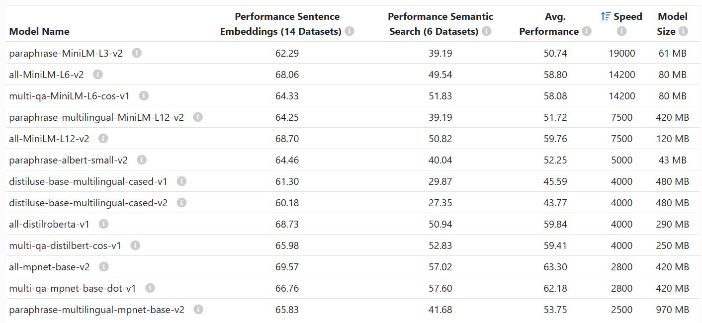

[Previous](03-evaluating-retrieval.md) | [Next](../README.md)

# Evaluating Vector Retrieval

We also evaluate the performance of vector-based search methods using Elasticsearch and Sentence Transformers and we use different ways of ranking search results using embeddings.

1. Import necessary libraries and load Documents

```python
with open('documents-with-ids.json', 'rt') as f_in:
    documents = json.load(f_in)
```

2. Load a pre-trained Sentence Transformer model to encode text into vectors:



```python
model_name = 'multi-qa-MiniLM-L6-cos-v1'
model = SentenceTransformer(model_name)
```

This model generates vectors with 384 components, which are used in the vector search methods to find and rank relevant documents.

3. Initialize Elastic Search client, and create an index with specific settings and mappings for storing dense vectors:

```python
es_client = Elasticsearch('http://localhost:9200')

index_settings = {
    "settings": {
        "number_of_shards": 1,
        "number_of_replicas": 0
    },
    "mappings": {
        "properties": {
            "text": {"type": "text"},
            "section": {"type": "text"},
            "question": {"type": "text"},
            "course": {"type": "keyword"},
            "id": {"type": "keyword"},
            "question_vector": {
                "type": "dense_vector",
                "dims": 384,
                "index": True,
                "similarity": "cosine"
            },
            "text_vector": {
                "type": "dense_vector",
                "dims": 384,
                "index": True,
                "similarity": "cosine"
            },
            "question_text_vector": {
                "type": "dense_vector",
                "dims": 384,
                "index": True,
                "similarity": "cosine"
            },
        }
    }
}

index_name = "course-questions"

es_client.indices.delete(index=index_name, ignore_unavailable=True)
es_client.indices.create(index=index_name, body=index_settings)
```

where we use

- Question Embeddings: This method uses embeddings generated from the questions only.
- Text Embeddings: This method uses embeddings generated from the answers (text) only.
- Question and Text Embeddings: This method creates embeddings by combining both the question and the answer text.

These approaches help in determining which method provides the most accurate and relevant search results based on different ways of representing the data.

4. Encode the text fields of each document into vectors and index them in Elasticsearch

5. Define search functions: perform k-NN search using different vector fields

Elasticsearch KNN Setup:

```python
def elastic_search_knn(field, vector, course):
    knn = {
        "field": field,
        "query_vector": vector,
        "k": 5,
        "num_candidates": 10000,
        "filter": {
            "term": {
                "course": course
            }
        }
    }

    search_query = {
        "knn": knn,
        "_source": ["text", "section", "question", "course", "id"]
    }

    es_results = es_client.search(
        index=index_name,
        body=search_query
    )
    
    result_docs = []
    
    for hit in es_results['hits']['hits']:
        result_docs.append(hit['_source'])

    return result_docs
```

Search Methods:
- `question_vector_knn`: Uses the `question_vector` field for k-NN search.
- `text_vector_knn`: Uses the `text_vector` field for k-NN search.
- `question_text_vector_knn`: Uses the `question_text_vector` field for k-NN search.

## Advanced Semantic Search


Previously, multi match text search was used to improve search accuracy by considering multiple text fields.
Advanced semantic search techniques go beyond basic vector search to provide more accurate and context-aware search results. While basic vector search involves encoding text into vectors and performing k-NN (k-Nearest Neighbors) search using these vectors, advanced semantic search combines multiple vector fields and uses more sophisticated scoring mechanisms to improve the relevance of search results.

- **Combining Multiple Vector Fields**: Instead of relying on a single vector field, we combine multiple vector fields (e.g., question vectors, text vectors, combined question-text vectors) to capture different aspects of the data. This helps in providing more comprehensive and context-aware search results.

- **Custom Scoring Scripts**: Use custom scoring scripts in Elasticsearch to combine the similarity scores from different vector fields. This allows us to fine-tune the scoring mechanism and improve the relevance of search results.

In the following example, we combine the similarity scores from three vector fields (`question_vector`, `text_vector`, `question_text_vector`) using a custom scoring script in Elasticsearch:

```python
def elastic_search_knn_combined(query, course):
    query_vector = model.encode(query)
    
    search_query = {
        "size": 5,
        "query": {
            "bool": {
                "must": [
                    {
                        "script_score": {
                            "query": {
                                "term": {
                                    "course": course
                                }
                            },
                            "script": {
                                "source": """
                                    cosineSimilarity(params.query_vector, 'question_vector') + 
                                    cosineSimilarity(params.query_vector, 'text_vector') + 
                                    cosineSimilarity(params.query_vector, 'question_text_vector') + 
                                    1
                                """,
                                "params": {
                                    "query_vector": query_vector
                                }
                            }
                        }
                    }
                ],
                "filter": {
                    "term": {
                        "course": course
                    }
                }
            }
        },
        "_source": ["text", "section", "question", "course", "id"]
    }

    response = es_client.search(index=index_name, body=search_query)
    result_docs = [hit['_source'] for hit in response['hits']['hits']]
    return result_docs
```

In this script:
- We encode the query into a vector using the pre-trained model.
- We create a search query that combines the cosine similarity scores from the `question_vector`, `text_vector`, and `question_text_vector` fields.
- The combined score is used to rank the search results, providing a more comprehensive and context-aware ranking.


6. Load ground truth data and perform a search

7. Calculate evaluation metrics (Hit rate and MRR)

8. Prints results:

```python
print(evaluate(ground_truth, question_vector_knn))
print(evaluate(ground_truth, text_vector_knn))
print(evaluate(ground_truth, question_text_vector_knn))
print(evaluate(ground_truth, vector_combined_knn))
```

Vector-based search methods in Elasticsearch generally offer better accuracy compared to text-only search. For instance, using the question vector alone showed a 6% improvement in Mean Reciprocal Rank (MRR). Other vector methods, like text vector and combined question-text vector, performed even better. However, these methods tend to be slower.

The more complex combined vector search was significantly slower and didn't offer a substantial improvement in performance. Therefore, it's crucial to balance speed and accuracy when choosing a search method. In many cases, simpler or more basic vector search methods are more effective than more complex ones, as they provide better performance without the added complexity and slowdown.


[Previous](03-evaluating-retrieval.md) | [Next](../README.md)
